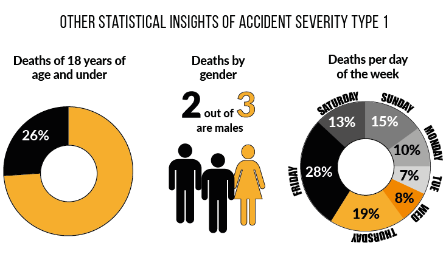

**Author**:
Leticia Kemp, Health Data Science, School of Medicine, Swansea University

## Poster Abstract

###What is the risk of dying in a road accident in Swansea, Wales?

A literature review suggests that the recorded road casualties have been decreasing over the last decade in Wales, however world-wide road traffic injuries are still predicted to rise to become the 7^th^ leading cause of death by 2030. 

Swansea is situated in the middle of the South Wales coastal area and has the second largest local authority population in Wales (242,400). The importance of identifying data patterns in particular precinct areas remains imperative when death occurs from a road casualty. An exploratory data analysis (EDA) was carried out to find the potential risks of such casualties for the wider population in the area. These findings are important in assisting government, road safety and law enforcement agencies in identifying high risk localities by focusing on local policy making of prevention measures.

A risk model summarising risk factors of accident of severity type 1 (fatal) occurred in Swansea was produced from data sourced between 2005 and 20148*. The data consisted of road accident and casualty statistics recorded by police authorities; a part of the Open Data initiative in the UK. 

The model was produced by linking the accident data, census data and administrative boundaries map data of 148 Lower Super Output Areas (LSOAs) of Swansea. The rates were calculated as follows:
<br>
<br>

$$Basic\hspace{1mm}Rate=\frac{Total\hspace{1mm}number\hspace{1mm}of\hspace{1mm}accidents}{Total\hspace{1mm}road\hspace{1mm}Km}$$
<br>
<br>
$$Adjusted\hspace{1mm}Rate=\hspace{1mm}\frac{Total\hspace{1mm}number\hspace{1mm}severity\hspace{1mm}type\hspace{1mm}1\hspace{1mm}accidents}{Total\hspace{1mm}accidents*Basic\hspace{1mm}Rate}$$ 


<br>


The risk rates result show that low risk combined with very low risk rate covered 87.16% of the LSOAs, representing a great part of Swansea as having low risk of road death. While the medium risk rate covered 9.46% of areas, the high and very high risk rate combined totalled at only 3.38% of LSOAs in Swansea. Nonetheless, there are still specific LSOAs in the precincts of Landore, Castle and Morriston that present a higher risk of road casualties resulting in death. 

Other significant statistical insights of the accident severity type 1 was that 26% of the deaths were of people ages 18 and under; and that 2 out of 3 people involved were males.


```{r, echo=FALSE, out.width = "600px", fig.align="center"}

```

*$\small{The\hspace{1mm} combined\hspace{1mm} dataset\hspace{1mm} provided\hspace{1mm} did\hspace{1mm} not\hspace{1mm} contain\hspace{1mm} data\hspace{1mm} for\hspace{1mm} the\hspace{1mm} year\hspace{1mm} 2007.}$

